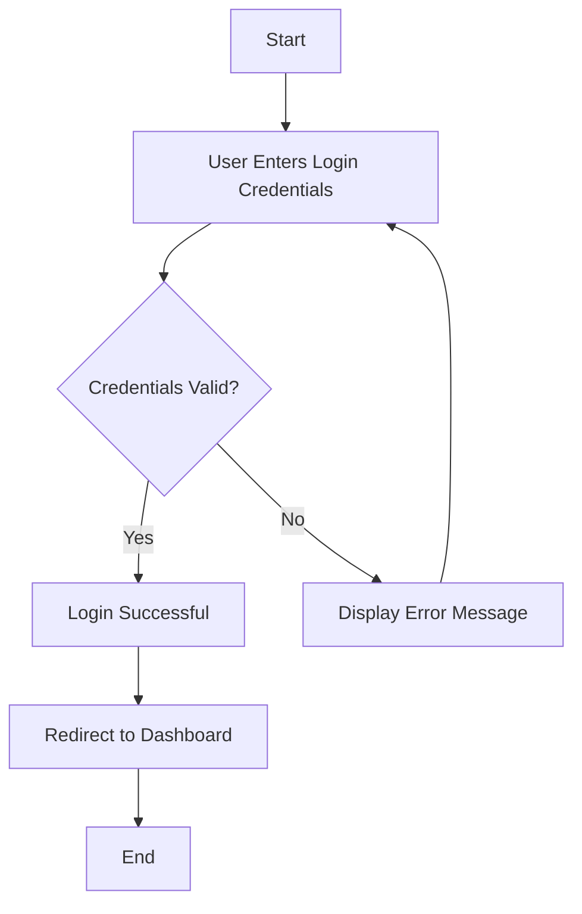
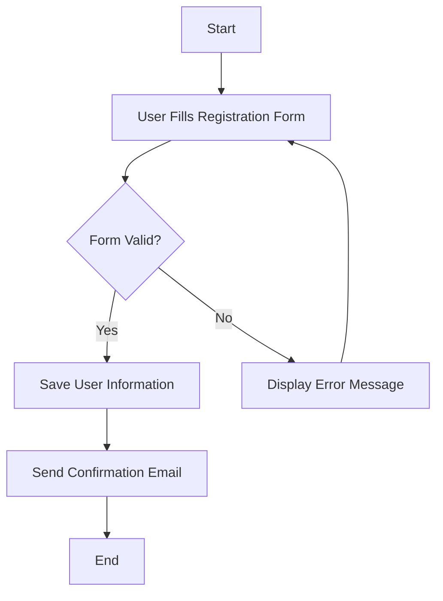
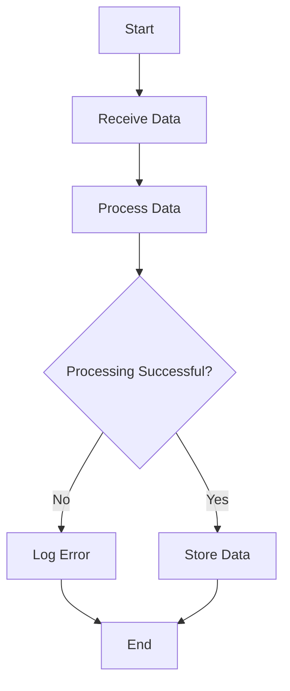

# Activity Diagrams for SEOP Application

## User Login Flow

```mermaid
graph TD;
    A[Start] --> B[User Enters Login Credentials];
    B --> C{Credentials Valid?};
    C -->|Yes| D[Login Successful];
    C -->|No| E[Display Error Message];
    E --> B;
    D --> F[Redirect to Dashboard];
    F --> G[End];
```

## User Registration Flow

```mermaid
graph TD;
    A[Start] --> B[User Fills Registration Form];
    B --> C{Form Valid?};
    C -->|Yes| D[Save User Information];
    C -->|No| E[Display Error Message];
    E --> B;
    D --> F[Send Confirmation Email];
    F --> G[End];
```

## Data Processing Flow

```mermaid
graph TD;
    A[Start] --> B[Receive Data];
    B --> C[Process Data];
    C --> D{Processing Successful?};
    D -->|Yes| E[Store Data];
    D -->|No| F[Log Error];
    F --> G[End];
    E --> G;
```
